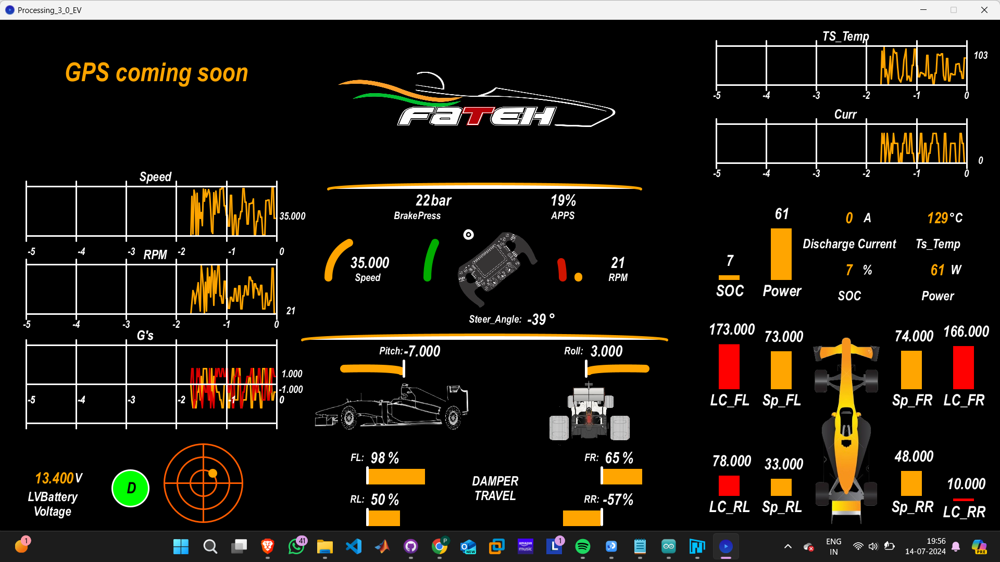

# DATA VISUALIZATION SYSTEM
Refer to New version(Processing_3.0_EV)

Data visualization is the representation of data through use of common graphics, such as charts, plots, infographics, and even animations. After going through and analyzing all of the scenarios, the one we hand-pick is the Processing Language. Processing is a programming language and environment designed for creating visual and interactive applications.

In this system we control Processing sketches with the Arduino via serial communication and visualize sensor data in real-time.

The Arduino code was written in such a way that it reads the value of each and every sensor and prints the data in serial form so that the data can be further  used for controlling Processing sketches.

Sensor Values were mapped according to the requirements.

<h3>CODE SNIPPET</h3>

```jsx
int gaugeValue = 0;
int gaugeValue2 = 0;

void setup() {
  // Serial2.begin(230400);
  Serial.begin(9600);
  pinMode(A0,INPUT);
  pinMode(A1,INPUT);
}

void loop() {
  gaugeValue = analogRead(A0);
  gaugeValue2 = analogRead(A1);
  Serial.print(millis());
  Serial.print(",");
  Serial.print(map(gaugeValue, 0, 1023, 0, 11000));  //RPM
  Serial.print(",");
  Serial.print("80");  //Engine Temperature
  Serial.print(",");
  Serial.print("4");  //Gear
  Serial.print(",");
  Serial.print(map(gaugeValue2, 0, 1023, 0, 150));  //Speed
  Serial.print(",");
  Serial.print(map(gaugeValue, 0, 1023, 0, 100));  //Brake Pressure
  Serial.print(",");
  Serial.print("12");  //Battery Voltage
  Serial.print(",");
  Serial.print("1");  //Radiator
  Serial.print(",");
  Serial.print("0");  //Data Logging
  Serial.print(",");  
  Serial.print(map(gaugeValue2, 0, 1023, 0, 100));  //Throttle
  Serial.print(",");
  Serial.print(map(gaugeValue2, 0, 1023, 0, 120));  //Brake Temperature
  Serial.print(",");
  Serial.print(map(gaugeValue, 0, 1023, 0, 150));  //Front Left
  Serial.print(",");
  Serial.print(map(gaugeValue2, 0, 1023, 0, 150));  //Front Right
  Serial.print(",");
  Serial.print(map(gaugeValue, 0, 1023, 0, 150));  //Rear Left
  Serial.print(",");
  Serial.print(map(gaugeValue2, 0, 1023, 0, 150));  //Rear Right
  Serial.print(",");
  Serial.print(gaugeValue);  //Accelerometer X Axis
  Serial.print(",");
  Serial.print(gaugeValue2);  //Accelerometer Y Axis
  Serial.print(",");
  Serial.println("30");  //Steering Angle
}
```

For Integrating Arduino IDE with Processing we first need to import the Serial Library

```jsx
import processing.serial.*;
```

Array of each parameter is made that is needed to be represented in the GUI system:

```jsx
int[] values = new int[18];
int[] rpm = new int[385];
int[] speed = new int[385];
int[] brakePress = new int[385];
int[] throttle = new int[385];
int[] brakeTemp = new int[385];
int[] xAccel = new int[240];
int[] yAccel= new int[240];
int[] xAccel1 = new int[240];
int[] yAccel1= new int[240];
```

In the code snippet given below 

Image is loaded on the window, window size is specified and all the elements of all the arrays are assigned the value 0. 

The command [myPort = new Serial(this, Serial.list()[0], 9600);] determines the port through which serial communication will take place.

```jsx
void setup() {
img=loadImage("logoW.png");
size(1920, 1080);
smooth();
myPort = new Serial(this, Serial.list()[0], 9600);
for (int i = 0; i < rpm.length; i++) {
rpm[i] = 0;
speed[i] = 0;
brakePress[i] = 0;
throttle[i] = 0;
brakeTemp[i] = 0;
}
for (int i = 0; i < xAccel.length; i++) {
xAccel[i] = 0;
yAccel[i] = 0;
xAccel1[i] = 0;
yAccel1[i] = 0;
}
}
```

In this code snippet, we are pushing the values to the serial port that are coming from different sensors by serial communication.

All these values are later stored in the string as separate elements.

```jsx

if (myPort.available() > 0) {
String input = myPort.readStringUntil('\n');
println(input);
if (input != null) {
String[] valuesStr = split(input.trim(), ",");
if (valuesStr.length==18) {
for (int i = 0; i < values.length; i++) {1`1
values[i] = int(valuesStr[i]);
```

Through this set of statements we are pushing the data backward as the new data is being acquired

this set of statements is used in the drawgraph function.     

```jsx
for (int i = 0; i < rpm.length-1; i++) {
rpm[i] = rpm[i+1];
speed[i] = speed[i+1];
brakePress[i] = brakePress[i+1];
throttle[i] = throttle[i+1];
brakeTemp[i] = brakeTemp[i+1];
}
rpm[rpm.length-1] = randValue;
speed[speed.length-1] = randValue1;
brakePress[brakePress.length-1] = randValue2;
throttle[throttle.length-1] = randValue3;
brakeTemp[brakeTemp.length-1] = randValue4;
for (int i = 0; i < xAccel.length-1; i++) {
xAccel[i] = xAccel[i+1];
yAccel[i] = yAccel[i+1];
xAccel1[i] = xAccel1[i+1];
yAccel1[i] = yAccel1[i+1];
}
```

The Processing code was written in such a way that it reads the data coming in serial form and stores the data in an array, later the elements of array (i.e. different sensor values) are used to control Processing Sketches.

A different function is made for each and every Sketch.

Sketches include: 

1. drawGauge
2. drawGraph
3. Bar
4. Circular Graph
5. Data Receiving Indicator
6. Engine Indicator

**Some general functions that were used in the above functions are:**

**pushMatrix()**-Pushes the current transformation matrix onto the matrix stack.The **pushMatrix()**
function saves the current coordinate system to the stack.

```jsx
Syntax-PushMatrix()
```

**translate()-**Specifies an amount to displace objects within the display window.

```jsx
Syntax-translate(x, y, z) 
```

```jsx
**x**(float)left/right translation
```

```jsx
**y**(float)up/down translation
```

```jsx
**z**(float)forward/backward translation
```

**popMatrix()-**Pops the current transformation matrix off the matrix stack. ****It ****restores the prior coordinate system.

```jsx
Syntax-popMatrix()
```

**strokeWeight()-**Sets the width of the stroke used for lines, points, and the border around shapes. All widths are set in units of pixels.

```jsx
Syntax-strokeWeight(weight)
```

s**troke()**-Sets the color used to draw lines and borders around shapes.

```jsx
Syntax
```

```jsx
stroke(rgb)
```

```jsx
stroke(gray)
```

```jsx
stroke(v1, v2, v3)
```

```jsx
Parameters
```

```jsx
**rgb**(int)color value in hexadecimal notation
```

```jsx
**v2**(float)green or saturation value (depending on current color mode)
```

```jsx
**v3**(float)blue or brightness value (depending on current color mode)
```

**fill()-**Sets the color used to fill shapes.

```jsx
Syntax-fill(v1, v2, v3, alpha)
```

These sketches represent:

1. Speed
2. RPM
3. Throttle Position
4. Brake Pressure
5. G's

Also, A function is made to represent Raw Data Values.

Other Important parameters like:

- >Gear
->Engine Temperature
->Battery Voltage
->Steering Angle

This system is designed keeping in mind the requirements to improve the performance of the car on track as well as off-track. It provides provide an easy and understandable user interface for observing the vehicle's performance.

Have also been represented.

The final GUI System looks like this:


<h3>New Version of FSAE Telemetry for Electric Vehicle(Please refer to Processing_3.0_EV)</h3>



